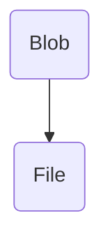

This post is a part 18 of  [Advanced JavaScript APIs](http://qnimate.com/post-series/advanced-javascript-apis/)  post series.


# An Introduction To JavaScript Blobs and File Interface
## 兩點記住甚麼是Blob
第一：可以用來儲存二進位資料，但是,這樣做甚麼?難道不能用檔案來儲存? 答案是,這是一個URL,也就是,可以再讓其他遠端拿取。這是和File不一樣的地方了。
第二:File繼承自Blob.




### 使用方式

blob的使用方式和File一樣。但是,到底是在記憶體中還是硬碟中,要看瀏覽器和大小而定。因此實際上,他並不是一個檔案。


Content of a blob can be read as  [ArrayBuffer](http://qnimate.com/javascript-arraybuffers-and-typed-arrays)  and therefore it makes blobs very handy to store binary data.

### 建立Blob

第一個參數,必須是`[]`第二個參數則是MIME型態。

```js
var myBlob =  new Blob(["This is my blob content"],  {type :  "text/plain"});
```

因為Blob的兩個特徵,因此使用方法也是大概分兩類,當成檔案讀取,當成URL讀取:

### 當成檔案讀取:
```js
//first arguement must be an regular array. The array can be of any javascript objects. Array can contain array to make it multi dimensional 
//second parameter must be a BlogPropertyBag object containing MIME property
var myBlob = new Blob(["This is my blob content"], {type : "text/plain"});
var myReader = new FileReader();
//handler executed once reading(blob content referenced to a variable) from blob is finished. 
myReader.addEventListener("loadend", function(e){
    document.getElementById("paragraph").innerHTML = e.srcElement.result;//prints a string
});
//start the reading process.
myReader.readAsText(myBlob);
```
``` html
<p id="paragraph"></p>
```

### 當成URLs讀取

#### 當然是先看一下怎樣建立Blob URL:

```js
//cross browser
window.URL = window.URL || window.webkitURL;

var blob = new Blob(['body { background-color: yellow; }'], {type: 'text/css'});

var link = document.createElement('link');
link.rel = 'stylesheet';
//createObjectURL returns a blob URL as a string.
link.href = window.URL.createObjectURL(blob);
document.body.appendChild(link);
```

#### 讀取 

 
```js
var xhr = new XMLHttpRequest(); 
xhr.open("GET", "/favicon.png"); 
xhr.responseType = "blob";//force the HTTP response, response-type header to be blob
xhr.onload = function() {
    document.getElementsByTagName("body")[0].innerHTML = xhr.response;//xhr.response is now a blob object
}
xhr.send();
```
We can get the blob content in an ArrayBuffer and then analyze the ArrayBuffer as binary data. This can be done using  **FileReader.readAsArrayBuffer() method**.
```js
var xhr = new XMLHttpRequest(); 
xhr.open("GET", "/favicon.png"); 
//although we can get the remote data directly into an arraybuffer using the string "arraybuffer" assigned to responseType property. For the sake of example we are putting it into a blob and then copying the blob data into an arraybuffer.
xhr.responseType = "blob";

function analyze_data(blob) {
    var myReader = new FileReader();
    myReader.readAsArrayBuffer(blob)
    
    myReader.addEventListener("loadend", function(e) {
        var buffer = e.srcElement.result;//arraybuffer object
    });
}

xhr.onload = function() {
    analyze_data(xhr.response);
}
xhr.send();
```
### File Interface

A  `File` 參考到本地檔案系統的一個檔案。在Javascript 中無法建立一個File物件,而是必須藉由,`<input type="file">` 拿到,例如:


```js
var element = document.getElementsByTagName("body")[0];

//files is a filelist
function fileselected(files) {
    for(var i = 0; i < files.length; i++) 
    {
        var f = files[i];
        element.innerHTML = element.innerHTML + f.name + " " + f.size + " " + f.type; 
    }
}
```

