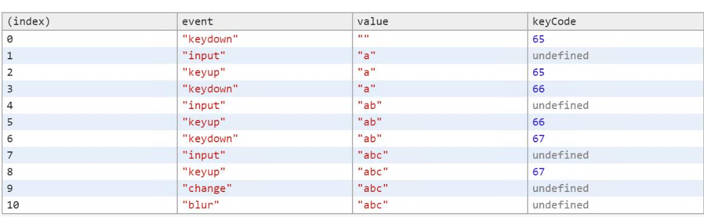
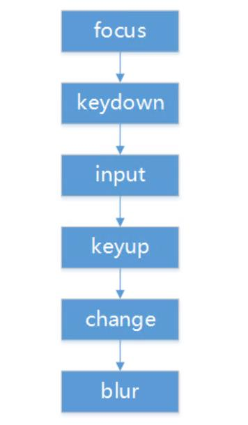

## [KeyEvent_1.html](KeyEvent_1.html)
@import "Event_Key_1.html" {code_block=true,class="line-numbers"}

從圖中可以看出如下結論： 
1. keydown事件發生時，輸入值並沒有發生變化，所以keydown可用於阻止某些輸入字符的顯示。 
2. input事件發生時，無法獲取到keyCode值，並且緊隨在keydown事件之後。 
3. keyup事件最後發生，一次鍵盤敲入事件徹底完成。 
4. change事件只會發生在輸入完成後，也就是輸入框失去焦點之前。

2. 輸入完成後觀察
當用戶完成所有的輸入時，這時候必定會發生blur事件，只有這時才會觸發change，所以可用blur與change監聽用戶輸入是否完成，輸入框的驗證多半發生在此時。

3. 輸入事件流
輸入框發生的事件流程依次為focus、keydown、input、keyup、change與blur，見下圖所示。

